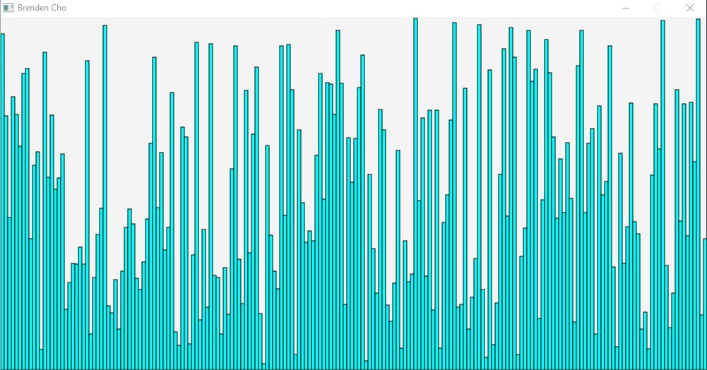

# Sorting Algorithms

Description
 
###### This is a collection of Sorting Algorithms visualized using Java Fx. There are 8 algorithms including selection, insertion, bubble, cocktail shaker, quick, gnome, comb, stooge.

# How to Download and Run

Download the download folder to your computer and double click the run.bat file. Alternatively you can open up your command prompt and type the command java -jar Sorting.jar or java -jar "path\to\Sorting.jar" .

# Features
* Object Oriented Programming
* Recursion
* Exception Handling
* JavaFX
* Popular Sorting Alogorithims
## General Use  
The randomize button will randomly create and fill an array of size 200. You can then pick from one of the 8 algorithms and press the start button. You can also hover over any of the rectangles to see its value.
# Algorithms
## Selection Sort
Worst Time Space:О(n2) 
Average Time Space:О(n2) 
This algorithim works by going over every element in the array and picking the smallest value. It will then move that value to the front of the array. It will then repeat this process by looking at a smaller portion of the array each time until it is sorted.
## Bubble Sort
Worst Time Space:О(n2) 
Average Time Space:О(n2) 
This algorithim works by comparing two elements at a time. If the value in the array in the second elemtnt is less than the value in the first, it will swap the two elements. It will then move forward and compare the next elements. It will keep doing this until the array is sorted.
## Cocktail Shaker Sort
Worst Time Space:О(n2) 
Average Time Space:О(n2) 
This is a variation of bubble sort. It works the same way except when the end of array is reached instead of starting back at the fron it will go in reverse. 
## Insertion Sort
Worst Time Space:О(n2)
Average Time Space:О(n2) 
This is an algorithim which inserts an element into its proper place in the sorted part of the array. It will move across the array and place each element into its proper place.
## Quick Sort
Worst Time Space:О(n2) 
Average Time Space:О(n log n) 
"Quicksort is a divide-and-conquer algorithm. It works by selecting a 'pivot' element from the array and partitioning the other elements into two sub-arrays, according to whether they are less than or greater than the pivot. The sub-arrays are then sorted recursively"(https://en.wikipedia.org/wiki/Quicksort)
## Gnome Sort
Worst Time Space:О(n2) 
Average Time Space:О(n2) 
"The gnome sort is a sorting algorithm which is similar to insertion sort in that it works with one item at a time but gets the item to the proper place by a series of swaps, similar to a bubble sort. The algorithm finds the first place where two adjacent elements are in the wrong order and swaps them. It takes advantage of the fact that performing a swap can introduce a new out-of-order adjacent pair next to the previously swapped elements. It does not assume that elements forward of the current position are sorted"(https://en.wikipedia.org/wiki/Gnome_sort)
## Comb Sort
Worst Time Space:О(n2) 
Average Time Space:О(n2/2p) where p is the numer of increments
"In bubble sort, when any two elements are compared, they always have a gap (distance from each other) of 1. The basic idea of comb sort is that the gap can be much more than 1. The inner loop of bubble sort, which does the actual swap, is modified such that the gap between swapped elements goes down (for each iteration of outer loop) in steps of a "shrink factor" k: [ n/k, n/k2, n/k3, ..., 1 ].
The gap starts out as the length of the list n being sorted divided by the shrink factor k (generally 1.3; see below) and one pass of the aforementioned modified bubble sort is applied with that gap. Then the gap is divided by the shrink factor again, the list is sorted with this new gap, and the process repeats until the gap is 1. At this point, comb sort continues using a gap of 1 until the list is fully sorted."(https://en.wikipedia.org/wiki/Comb_sort)
## Stooge Sort
Worst Time Space:	O(nlog 3/log 1.5) 
"The algorithm is defined as follows:
If the value at the start is larger than the value at the end, swap them.
If there are 3 or more elements in the list, then:
Stooge sort the initial 2/3 of the list
Stooge sort the final 2/3 of the list
Stooge sort the initial 2/3 of the list again"(https://en.wikipedia.org/wiki/Stooge_sort)
## Contact
Brendencho44@gmail.com
